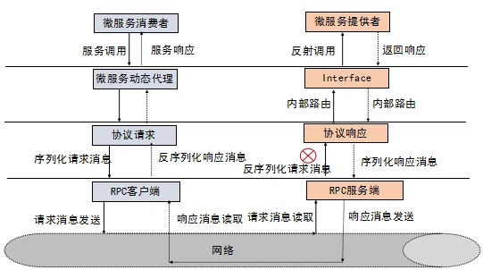

protoc-3.17.0-windows-x86_64.exe proto\helloworld.proto --java_out=java
protoc-3.17.0-windows-x86_64.exe proto\helloworld.proto --plugin=protoc-gen-grpc-java=protoc-gen-grpc-java-1.37.0-windows-x86_64.exe --grpc-java_out=java
# RPC框架

## 简介
    RPC框架的目标是让远程调用更加简单，透明。RPC框架负责屏蔽底层传输方式（TCP或者UDP），序列化方式（XML、JSON，二进制）以及通信细节。
    服务调用方可以像调用本地接口一样调用远程服务提供者，而不用关心底层通信细节和调用过程。
## 主流RPC框架

    